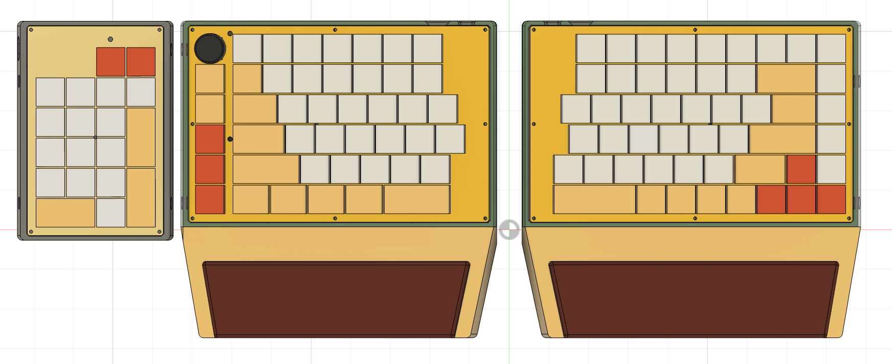
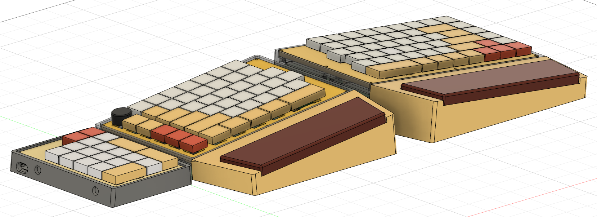

# ksn2-firmware

ZMK firmware for the KSN-2 split keyboard — a 70% split derived from [KSN-1](https://github.com/Kesaros44/ksn1-firmware), reusing its custom LED-driver and `wakeup-source` patterns.

* Keyboard Maintainer: [AJG](https://github.com/Kesaros44)
* Hardware Supported: KSN-2 split keyboard, nice!nano v2 (nRF52840), BLE




## Hardware

- **MCU:** nice!nano v2 (nRF52840) per half, wireless (BLE)
- **Central:** left half (unlike KSN-1, where central is the right half)
- **Matrix:** 6 rows × 9 columns per half, 6×18 combined, `col2row`
- **Encoder:** one EC11 encoder, left half (central) only
- **LEDs (left/central only):** Caps Lock LED, BLE connection-status LED
- **Backlight:** designed into the schematic (PWM, pin `P0.06` on both halves), but parts aren't populated and the feature is disabled in firmware — no backlight on the physical board
- **RGB underglow:** none
- **Battery:** reported from both halves

## Keymap (`config/ksn_2.keymap`)

Three layers, same structure as KSN-1:

- **`default_layer`** — Windows base layer. Left encoder = volume. Left column 8 is unused (`&none` — not physically wired on this half).
- **`func_layer`** (hold `&mo 1`) — Bluetooth profile select (0–4) and output toggle, backlight inc/dec on the encoder (no-op — no backlight hardware), toggle (`&tog 2`) into `mac_layer`.
- **`mac_layer`** — same shape as `default_layer`, with Mac modifier ordering and Mac media/brightness keys in place of the F-row.

## Building

GitHub Actions builds on every push — grab the `.uf2` files (`ksn_2_left`, `ksn_2_right`, `settings_reset`) from the workflow run's artifacts.

Local build with `west`:

```sh
west init -l config
west update
west build -p -b nice_nano_v2 -- -DSHIELD=ksn_2_left -DZMK_EXTRA_MODULES=$(pwd)/config
west build -p -b nice_nano_v2 -- -DSHIELD=ksn_2_right -DZMK_EXTRA_MODULES=$(pwd)/config
```

## Flashing

Double-tap reset on the nice!nano to enter the UF2 bootloader, then drag the matching `.uf2` onto the `NICENANO` drive (left firmware → left/central half, right → right/peripheral half). Flash both halves — they run different images (only the left build has `CONFIG_ZMK_SPLIT_ROLE_CENTRAL=y`, the encoder, and both LED drivers).

## Re-pairing / clearing Bluetooth bonds

Flash the `settings_reset` artifact to a half to wipe its BLE bonds, then reflash normal firmware and re-pair.

## Recent Changes

- Added dedicated Hangul (`LANG1`) / Hanja (`LANG2`) keys to the right thumb cluster (ported from KSN-1); `mac_layer`'s Hanja key sends `LA(RET)` (Option+Return) instead, since macOS doesn't treat `LANG2` as Hanja.
- Ported KSN-1's `word_flip` fixes and switched its macOS language toggle to Caps Lock.
- Reordered the right thumb row and reworked the left outer column for OS-specific shortcuts (lock screen, screenshot, etc.).
- Reversed the encoder's rotation direction.
- Raised BLE TX power by +8dBm for more reliable connections.

## Known Issues / TODO

- **USB PID not registered:** `CONFIG_USB_DEVICE_PID=0x4B54` is a temporary placeholder, same situation as [KSN-1](https://github.com/Kesaros44/ksn1-firmware)'s `0x4B53`.
- **No right RCTRL:** replaced by the Hanja key — Ctrl now lives only on the left half.
- **word_flip's macOS delete may share a word-boundary bug found on KSN-3:** on 2026-09-16, [KSN-3](https://github.com/Kesaros44/ksn3-firmware) found that Option+Backspace doesn't respect word boundaries inside Hangul IME composition and switched to resending plain Backspace instead. This board still uses Option+Backspace for that step — check whether it needs the same fix.
- **Possible unintentional Shift asymmetry:** `default_layer` has `RSHFT` at the right-side R4 second-to-last position, `mac_layer` has `LSHFT` in the same spot. Worth double-checking whether that's intentional.

---

# ksn2-firmware (한국어)

KSN-2 스플릿 키보드용 ZMK 펌웨어 설정입니다 — [KSN-1](https://github.com/Kesaros44/ksn1-firmware)에서 파생된 70% 스플릿 보드이며, 커스텀 LED 드라이버와 `wakeup-source` 패턴을 재사용합니다.

* 키보드 관리자: [AJG](https://github.com/Kesaros44)
* 지원 하드웨어: KSN-2 스플릿 키보드, nice!nano v2 (nRF52840), BLE

## 하드웨어

- **MCU:** half마다 nice!nano v2 (nRF52840), 무선(BLE)
- **Central:** 왼쪽 half (오른쪽이 central인 KSN-1과 반대)
- **매트릭스:** half당 6행 × 9열, 합쳐서 6×18, `col2row`
- **인코더:** EC11 인코더 1개, 왼쪽(central) half에만 있음
- **LED (왼쪽/central 전용):** Caps Lock LED, BLE 연결상태 LED
- **백라이트:** 회로도에는 설계되어 있지만(PWM, 양쪽 half 모두 `P0.06` 핀) 부품이 실장되지 않았고 펌웨어 기능도 꺼져 있음 — 실제 보드에는 백라이트 없음
- **RGB 언더글로우:** 없음
- **배터리:** 양쪽 half 모두 보고

## 키맵 (`config/ksn_2.keymap`)

KSN-1과 동일한 구조의 3개 레이어:

- **`default_layer`** — Windows 기본 레이어. 왼쪽 인코더 = 볼륨. 왼쪽 8번째 열은 사용 안 함(`&none` — 이 half엔 물리적으로 배선되지 않음).
- **`func_layer`** (홀드 `&mo 1`) — 블루투스 프로필 선택(0–4) 및 출력 토글, 인코더로 백라이트 증감(백라이트 하드웨어 자체가 없어서 실제 동작은 없음), `mac_layer`로의 토글(`&tog 2`).
- **`mac_layer`** — `default_layer`와 동일한 구조에 Mac 모디파이어 순서와 F행 대신 Mac 미디어/밝기 키.

## 빌드

GitHub Actions가 push마다 자동으로 빌드합니다 — 워크플로우 실행의 아티팩트에서 `.uf2` 파일(`ksn_2_left`, `ksn_2_right`, `settings_reset`)을 받으면 됩니다.

`west`로 로컬 빌드:

```sh
west init -l config
west update
west build -p -b nice_nano_v2 -- -DSHIELD=ksn_2_left -DZMK_EXTRA_MODULES=$(pwd)/config
west build -p -b nice_nano_v2 -- -DSHIELD=ksn_2_right -DZMK_EXTRA_MODULES=$(pwd)/config
```

## 플래싱

nice!nano의 리셋 버튼을 더블탭해서 UF2 부트로더로 진입한 뒤, 마운트된 `NICENANO` 드라이브에 해당하는 `.uf2`(왼쪽 → 왼쪽/central half, 오른쪽 → 오른쪽/peripheral half)를 드래그하면 됩니다. 양쪽 half 모두 플래시해야 합니다 — 서로 다른 이미지를 사용합니다(왼쪽 빌드만 `CONFIG_ZMK_SPLIT_ROLE_CENTRAL=y`, 인코더, 두 LED 드라이버를 가짐).

## 재페어링 / 블루투스 본딩 초기화

`settings_reset` artifact를 해당 half에 플래시하면 BLE 본딩이 초기화됩니다. 그 다음 정상 펌웨어를 다시 플래시하고 재페어링하세요.

## 최근 변경 사항

- 오른쪽 엄지 클러스터에 전용 한/영(`LANG1`)·한자(`LANG2`) 키 추가(KSN-1에서 이식). `mac_layer`의 한자 키는 macOS에서 `LANG2`가 동작하지 않아 `LA(RET)`(Option+Return)로 대신 처리.
- KSN-1의 `word_flip` 수정 사항을 이식하고, macOS 언어 전환 방식을 Caps Lock으로 변경.
- 오른쪽 엄지 행 순서 재배치, 왼쪽 최외곽열을 OS별 단축키(잠금 화면, 스크린샷 등)로 재구성.
- 엔코더 회전 방향 반전.
- BLE 연결 안정성을 위해 TX 파워 +8dBm 상향.

## 알려진 이슈 / TODO

- **USB PID 미등록:** `CONFIG_USB_DEVICE_PID=0x4B54`도 [KSN-1](https://github.com/Kesaros44/ksn1-firmware)의 `0x4B53`과 마찬가지로 임시 값입니다.
- **오른쪽 RCTRL 부재:** 한자 키가 그 자리를 대체하면서 Ctrl은 왼쪽 half에만 남았습니다.
- **word_flip의 macOS 삭제 방식이 KSN-3에서 발견된 단어 경계 버그를 공유할 수 있음:** 2026-09-16, [KSN-3](https://github.com/Kesaros44/ksn3-firmware)에서 Option+Backspace가 한글 IME 조합 중 단어 경계를 지키지 않는 문제가 발견되어 일반 Backspace 반복 전송 방식으로 교체했습니다. 이 저장소는 아직 Option+Backspace를 쓰고 있어 같은 문제가 있을 수 있으니 확인이 필요합니다.
- **의도치 않은 Shift 비대칭 가능성:** `default_layer`의 오른쪽 R4 끝에서 두 번째 자리는 `RSHFT`, `mac_layer`의 같은 자리는 `LSHFT`로 되어 있습니다. 의도적인지 확인이 필요합니다.
